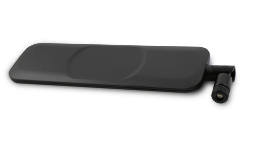

# Hardware Lab

Tools required for a hardware/physical hacking setup

# Wireless

## 1. ****700~5800 MHz Antenna****

Designed to cover all cellular, ISM and Wi-Fi working frequencies. 698-960 MHz, 1575.42 MHz, 1710-2700 MHz, 5150-5850 MHz

****$40.00 SKU: TG-358113**** 

[700~5800 MHz Antenna - Hacker Warehouse](https://hackerwarehouse.com/product/700-5800-mhz-antenna/)

## 2. ****20-6000 MHz Near Field Antenna****

This 25mm diameter, H-Loop antenna is very compact and RF sensitive, capable of operating within 20-6000 MHz.

****$35.00 SKU: S-H25**** 

[20-6000 MHz Near Field Antenna - Hacker Warehouse](https://hackerwarehouse.com/product/20-6000-mhz-near-field-antenna/)

## 3. ****Flipper Zero****

Features: Sub 1-ghz transceiver, 125kHz RFID, 13.56 MHz NFC, Bluetooth, Infrared Transceiver, 1-Wire iButton, expansion headers.

****$200.00****

[Flipper Zero - Hacker Warehouse](https://hackerwarehouse.com/product/flipper-zero/)

## 4. ****bladeRF 2.0 xA4 Kit****

Kit/Bundle Includes:

- bladeRF 2.0 micro xA4
- bladeRF micro case
- BT-100 Bias-tee Power Amplifier (TX)
- BT-200 Bias-tee Low Noise Amplifier (RX)

****RF SPECIFICATIONS****

- ADC/DAC Sample Rate: 0.521 – 61.44 MSPS
- ADC/DAC Resolution: 12 bits
- RF Tuning Range (RX): 70 – 6000 MHZ
- RF Tuning Range (TX): 47 – 6000 MHz
- CW Output Power: +8 dBm

****$600.00**** 

[bladeRF 2.0 xA4 Kit - Hacker Warehouse](https://hackerwarehouse.com/product/bladerf-2-xa4-kit/)

## 5. ****Ubertooth One****

****FEATURES****

- 2.4 GHz transmit and receive.
- Transmit power and receive sensitivity comparable to a Class 1 Bluetooth device.
- standard Cortex Debug Connector (10-pin 50-mil JTAG).
- In-System Programming (ISP) serial connector.
- expansion connector: intended for inter-Ubertooth communication or other future uses.
- six indicator LEDs.

****COMPONENTS****

- RP-SMA RF connector: connects to test equipment, antenna, or dummy load.
- CC2591 RF front end.
- CC2400 wireless transceiver.
- LPC175x ARM Cortex-M3 microcontroller with Full-Speed USB 2.0.
- USB A plug

The Ubertooth One is an open source 2.4 GHz wireless development platform suitable for Bluetooth experimentation. Commercial Bluetooth monitoring equipment can easily be priced at over $10,000 , so the Ubertooth was designed to be an affordable alternative platform for monitoring and development of new BT, BLE, similar and wireless technologies.

**$125.00** 

[Ubertooth One - Hacker Warehouse](https://hackerwarehouse.com/product/ubertooth-one/)

## 6. ****Proxmark3 RDV4****

****FEATURES****

- Read just about any RFID tag
- Pretend to be a reader or a tag
- Sniff communications between a reader and tag
- Operate in standalone mode without a PC (USB battery required)

****ADVANTAGES AND BENEFITS****

Compared with other on the market available Proxmark-like and RF cloning devices, the Proxmark3 is under constant development and the RDV4 offers the following improvements:

- Improved LF and HF antennas design for portability
- Improved shell
- Multi-function expansion port
- 4 mode LEDs, 4 power LEDs, User button

**$340.00** 

[Proxmark3 RDV4 Kit - Hacker Warehouse](https://hackerwarehouse.com/product/proxmark3-rdv4-kit/)

This Bluetooth and battery module (code name Blue Shark) is an addon to the Proxmark3 RDV4. By adding this module to a pm3rdv4, you have standalone capabilities as the 400 mAh battery will last several operational hours while also adding the ability to interact with the device though bluetooth wireless.

Features

- Built-in battery can support stand along mode, off-line sniffing, off-line reading & simulation, etc.
- Built-in Bluetooth 2.0 with EDR Bluetooth module, default baud rate 115200.
- Complete lithium charging management system, seamless switching power supply. Full overcharge and overdischarge protection.
- Bluetooth has an independent power switch that can be turned on or off.
- Compact and easy to carry. The clamp structure is easy to install and replace.
- Easily connect to Bluetooth mobile phone, laptop, portable computer, etc. Without USB cable and complicated ROOT and Driver settings.
- Temperature of the device is stable. Additional heat dissipating fins can significantly reduce the temperature when the HF antenna keep on for a long time.

Specs

- Battery capacity: 400 mAh
- Standby time: 3.5h StandBy; 2.9h LF-On; 50min HF-On;
- Charging Current: 200mA (plug in USB default charging)
- Charging time: 2.5h
- Bluetooth power: 4dBm, -85 dBm@2Mbps
- Bluetooth distance: 6m (depending on the environment and device orientation)
- Size and weight: 54.4mm * 29.4mm * 13.5mm 24g

****$100.00**** 

[Bluetooth + Battery Module for Proxmark3 RDV4 - Hacker Warehouse](https://hackerwarehouse.com/product/proxmark3-rdv4-bluetooth-battery-module/)

The Proxmark3 RDV4 LF Antenna Set comes with a LF medium antenna and LF long range antenna. The Proxmark3 RDV4 has a modular antenna system, allowing for antennas to be swapped depending on your engagement and distance requirements.

Each antenna is a 6 layer PCB, having 6 overlapping coils. Toggle switches for frequency and Q value depending on your target/scenario.

Switch options:

- Q 7 = Better accuracy when dumping card data
- Q 14 = Better range distance
- F 125 = Improved 125kHz tag range
- F 134 = Improved 134kHz tag range

**Antenna Type**LF/HF Standard Antenna (Fits in case)LF Medium Antenna (Fits in case)LF Long Range Antenna

**Read Distance**40 – 85mm66 – 98mm66 – 133mm

****$90.00**** 

[Proxmark3 RDV4 LF Antenna Set - Hacker Warehouse](https://hackerwarehouse.com/product/proxmark3-rdv4-lf-antenna-set/)

The Proxmark3 RDV4 HF Antenna Set comes with a HF medium antenna and HF long range antenna. The Proxmark3 RDV4 has a modular antenna system, allowing for antennas to be swapped depending on your engagement and distance requirements.

**Antenna Type**LF/HF Standard Antenna (Fits in case)HF Medium Antenna (Fits in case)HF Long Range Antenna

**Read Distance**40 – 85mm90mm100 – 120mm

****$90.00**** 

[Proxmark3 RDV4 HF Antenna Set - Hacker Warehouse](https://hackerwarehouse.com/product/proxmark3-rdv4-hf-antenna-set/)

T5557 cards are read/writable and are compatible with EM4100, HID and indala. The card operates at 125kHz.

10 cards are included per order.

****$30.00**** 

[T5557 read/write 125kHz card (10 Pack) - Hacker Warehouse](https://hackerwarehouse.com/product/t5557-readwrite-125khz-card/)

# Red Teaming

## 1. ****KeyGrabber****

These are physical hardware keyloggers that are completely transparent from computer operation, and no software or drivers are required. International keyboard layouts are also supported.

See the comparison chart as some versions have a clock/battery for times-stamping keystrokes. Some have a module for sending keystrokes via wireless so you don’t need full physical access again and can obtain keystrokes immediately via TCP direct stream or have keystrokes sent to you via email.

|  | PS/2 | USB Pico | USB WiFi Premium |
| --- | --- | --- | --- |
| Keyboard Connection Type | PS/2 | USB | USB |
| Device Length | 1.9″ | .8″ | 1″ |
| Memory Size | 4MB | 16MB | 16MB |
| Date and Timestamp | No | No | Yes |
| Wireless LAN Module | No | No | Yes |
| Mac compatibility | No | No | Yes |
| USB Mass Storage Mode | Yes | Yes | Yes |

**$55.00** 

[KeyGrabber - Hacker Warehouse](https://hackerwarehouse.com/product/keygrabber/)

## 2. ****USB Ninja Cable****

USB Ninja is an information security and penetration testing tool that looks and functions just like a regular USB cable (both power and data) until a wireless remote control triggers it to deliver your choice of attack payload to the host machine. In essence, USB Ninja is the next step in the evolution of BadUSB, embedding the attack in the USB cable itself.

Emulating keyboard and mouse actions, payloads can be completely customized and can be highly targeted. Undetectable by firewalls, AV software (**depending on payload of course**) or visual inspection, the USB Ninja is an ideal tool for penetration testers, police and government.

Includes: 1 cable type of choice and 1 trigger/programming ring.

****$75.00****

[USB Ninja Cable - Hacker Warehouse](https://hackerwarehouse.com/product/usb-ninja-cable/)

****USB Ninja Bluetooth Remote****

Wireless trigger device for the USB Ninja. Can trigger two different payloads via toggle buttons.

Accepts RP-SMA antennas if you want greater distances for remote payload triggering.

~~$60.00~~ **$50.00**

[USB Ninja Bluetooth Remote - Hacker Warehouse](https://hackerwarehouse.com/product/usb-ninja-bluetooth-remote/)

## 3. ****Rainbow Tables HDD****

****DESCRIPTION****

2tb usb 3.0 hdd filled with rainbow tables!

Contains:

- A51
- lm – alpha-numeric-symbol32-space
- WPA-PSK – 1 million words X 1000 SSIDs
- md5 – loweralpha-numeric_1-8
- md5 – mixalpha-numeric_1-7

****$150.00**** 

[Rainbow Tables HDD - Hacker Warehouse](https://hackerwarehouse.com/product/rainbow-tables-hdd/)

# Reverse Engineering

## 1. ****Chipwhisperer-Lite Bundle****

****DESCRIPTION****

Chipwhisperer-Lite:

- Embedded hardware security research tool
- Side-channel power analysis and glitching capabilities
- Open-source toolchain (GPL licensed)

Breaker Addon + NOTDuino Target Board:

- Includes the extra cables needed when breaking apart your ChipWhisperer-Lite.
- NOTDuino is an Atmel AVR based side-channel analysis and glitching target.

****$370.00****

[Chipwhisperer-Lite Bundle - Hacker Warehouse](https://hackerwarehouse.com/product/chipwhisperer-lite-bundle/)

## 2. ****JTAGulator Kit****

[JTAGulator](http://www.grandideastudio.com/portfolio/jtagulator/) is an open source hardware tool that assists in identifying On-chip debug (OCD) connections from test points, vias, or component pads on a target device.

Key Features:

- 24 I/O channels with input protection circuitry
- Adjustable target voltage: 1.2 V to 3.3 V
- Supported target interfaces (as of firmware v1.1): JTAG/IEEE 1149.1, UART/asynchronous serial
- USB interface for direct connection to host computer (PC, Macintosh, or *nix)

Application Ideas:

- Discover on-chip debug interfaces
- Simple logic analyzer
- Propeller development board

Includes: JTAGulator device, one set of data probes

Supporting Documentation:

- http://www.grandideastudio.com/portfolio/jtagulator/

****$195.00**** 

[JTAGulator Kit - Hacker Warehouse](https://hackerwarehouse.com/product/jtagulator/)

## 3. ****Bus Pirate Kit****

The [Bus Pirate](http://dangerousprototypes.com/docs/Bus_Pirate) is a universal electronic open hardware tool to program and interface with communication buses and program various chips, such as AVRs from Atmel and PICs from Microchip Technology. A primary usage case for this device as intended by the designers is to “Eliminate a ton of early prototyping effort with new or unknown chips.”Using a Bus Pirate, developers can use a serial terminal to interface with devices over a variety of hardware protocols, such as SPI and 1-Wire.

Support for many serial protocols with line levels of 0 – 5.5 volts:

- 1-Wire
- I²C
- SPI
- JTAG
- Asynchronous serial
- MIDI
- PC keyboard
- HD44780 LCD
- 2- and 3-wire libraries with bitwise pin control
- Scriptable binary bitbang, 1-Wire, I2C, SPI, and UART modes

Other capabilities:

- 0 – 6 volt measurement probe
- 1 Hz – 40 MHz frequency measurement
- 1 kHz – 4 MHz pulse-width modulator, frequency generator
- On-board multi-voltage pull-up resistors
- On-board 3.3 volt and 5 volt power supplies with software reset
- Macros for common operations
- Bus traffic sniffers (SPI, I²C)
- A bootloader for easy firmware updates
- Transparent USB -> serial mode
- 10 Hz – 1 MHz SUMP compatible low-speed logic analyzer
- AVR STK500 v2 programmer clone
- Supported in AVRDude programmer
- Scriptable from Perl, Python, etc.

Supporting Documentation:

- [http://dangerousprototypes.com/docs/Bus_Pirate](http://dangerousprototypes.com/docs/Bus_Pirate)

Reference Cards:

- [http://jan.rychter.com/enblog/bus-pirate-reference-card](http://jan.rychter.com/enblog/bus-pirate-reference-card)
- [http://dangerousprototypes.com/forum/viewtopic.php?f=4&t=6069](http://dangerousprototypes.com/forum/viewtopic.php?f=4&t=6069)

### **Includes: Bus Pirate, Acrylic Case, Data Probes**

****$50.00****

[Bus Pirate Kit - Hacker Warehouse](https://hackerwarehouse.com/product/bus-pirate/)

# Lab Tools

## 1. ****Digital Multimeter****

This basic multimeter can test voltage, current, resistance among other functions. This is a low-cost multimeter, but still has a solid build quality designed to last for years.

If you’re wondering what you use this for, check out [Sparkfun’s tutorial](https://learn.sparkfun.com/tutorials/how-to-use-a-multimeter) for a great guide about how to use multimeters.

# **Features:**

- DC Voltage measurement
- AC Voltage measurement
- Current measurement
- Continuity tester
- Diode tester
- Transistor tester
- 9V Battery Powered (included)
- High quality multimeter probes

Rs. 589 

[Digital Multimeter](https://protocentral.com/product/digital-multimeter/)

## 2. **KPH Hakko FX888D-23BY Digital Soldering Station**

| Brand | KPH |
| --- | --- |
| Item Weight | 2.6 Pounds |
| Item Dimensions LxWxH | 24.4 x 24.4 x 18.5 Centimeters |
| Voltage | 120 Volts |
| Wattage | 70.00 |

**₹13,399** 

[KPH Hakko FX888D-23BY Digital Soldering Station FX-888D FX-888 (Blue and Yellow)](https://www.amazon.in/Hakko-FX888D-23BY-Digital-Soldering-Station/dp/B00ANZRT4M/ref=sr_1_1?crid=3CENDY98JZ778&keywords=KPH+Hakko&qid=1669115115&qu=eyJxc2MiOiIxLjM3IiwicXNhIjoiMC4wMCIsInFzcCI6IjAuMDAifQ%3D%3D&s=industrial&sprefix=kph+hakko%2Cindustrial%2C181&sr=1-1)

## 3. **Smiledrive Digital HD Microscope**

Smiledrive Digital HD Microscope zooms in 50-1000x and observe many minute details of objects. It also comes with 4.3" LCD screen, built in 2600mAH rechargeable battery and 8 LED lights to control illumination. It can directly connect (via USB) with PC, also have a built-in MicroSD card slot (8GB)

**Specifications:-**

Item Weight: 680 grams

Package Dimensions: 9.7 x 7.6 x 5.3 inches

Battery: 2600mAh

Screen Size: 4.3 Inches LCD Screen

Magnifying: 50X~1000X Magnification

Led: 8 Adjustable LED Lights

₹**5,899** 

## 4. **Hantek DSO2C15 Digital Storage Oscilloscope**

1) 2 channels which are respectively controlled by independent knobs

2) 150MHZ analog channel bandwidth

3) Sampling rate up to 1 GSa/s

4) 8M memory depth

5) Vertical range 2mV/div ~ 10V/div

6) Vertical resolution: 8bit

7) Trigger: Edge, Pulse, Video, Slope, Overtime, Window, Pattern, Interval, Under Amp, UART, LIN, CAN, SPI, IIC

8) BUS decode and protocol analysis: RS232/UART, I2C, SPI, CAN, LIN

9) Can save multiple data formats, such as settings, waveforms, reference waveforms, CSV, pictures

10) A 3-digit digital voltage meter and a 6-digit hardware frequency indicator

11) 32 kinds of auto measurements with statistics, real-time statistics of maximum, minimum, standard deviation and etc.

12) 2 sets of digital voltmeters

13) Support threshold testing, free measurements within the screen

14) Abundant SCPI remote command control 15) USB Host/Device.

₹**30,000** 

[Hantek DSO2C15 Digital Storage Oscilloscope 150MHz Bandwidth 2CH Dual Channel 1GSa/s 8M Memory Depth](https://www.amazon.in/Hantek-DSO2C15-Digital-Oscilloscope-Bandwidth/dp/B08Y6M9TML/ref=sr_1_10?keywords=oscilloscope&qid=1669115395&qu=eyJxc2MiOiI2LjIyIiwicXNhIjoiNS44OSIsInFzcCI6IjIuNTUifQ%3D%3D&s=industrial&sprefix=os%2Cindustrial%2C189&sr=1-10&th=1)
