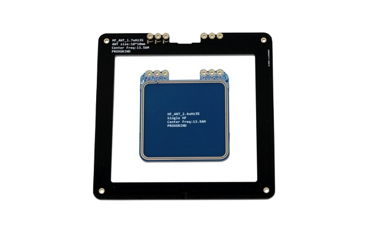

# 🔬 Professional Hardware Security Laboratory

```bash
> seedon@lab:~$ whoami
```
**Hardware Security Engineer** | **Physical Security Researcher** | **Lab Architect**

```bash
> seedon@lab:~$ cat mission-statement.txt
```

🎯 **Mission:** *Advancing hardware security through comprehensive physical analysis capabilities*

## 🏗️ Laboratory Overview

```bash
> seedon@lab:~$ cat lab-overview.txt
```

🔧 **Professional Hardware Security Lab Setup**  
⚡ Essential tools for hardware penetration testing, reverse engineering, and red teaming  
🔍 RF/wireless analysis equipment for comprehensive signal testing  
📡 Signal generation and capture capabilities for advanced research  
🛠️ Physical debugging and analysis tools for embedded systems  
⚙️ Power systems and precision measurement equipment for circuit analysis  
🔒 Fault injection and side-channel analysis capabilities  

## 📁 Equipment Categories

```bash
> seedon@lab:~$ ls equipment/ | grep -E "^[📡🎯🔍⚙️]"
```

| Category | Description | Investment Level |
|----------|-------------|------------------|
| 📡 **`wireless/`** | RF analysis and signal capture tools | $500 - $3000+ |
| 🎯 **`red-teaming/`** | Physical security testing equipment | $200 - $1500 |
| 🔍 **`reverse-eng/`** | Hardware debugging and analysis | $300 - $2000+ |
| ⚙️ **`lab-tools/`** | Essential bench and measurement equipment | $1000 - $5000+ |

```bash
> seedon@lab:~$ ./show-equipment.sh --detailed
```

# 📡 Wireless Analysis Equipment

## 1. **700~5800 MHz Antenna**


Designed to cover all cellular, ISM and Wi-Fi working frequencies. 698-960 MHz, 1575.42 MHz, 1710-2700 MHz, 5150-5850 MHz

**$40.00 SKU: TG-358113** 

[700~5800 MHz Antenna - Hacker Warehouse](https://hackerwarehouse.com/product/700-5800-mhz-antenna/)

## 2. **20-6000 MHz Near Field Antenna**


This 25mm diameter, H-Loop antenna is very compact and RF sensitive, capable of operating within 20-6000 MHz.

**$35.00 SKU: S-H25** 

[20-6000 MHz Near Field Antenna - Hacker Warehouse](https://hackerwarehouse.com/product/20-6000-mhz-near-field-antenna/)

## 3. **Flipper Zero**


Features: Sub 1-ghz transceiver, 125kHz RFID, 13.56 MHz NFC, Bluetooth, Infrared Transceiver, 1-Wire iButton, expansion headers.

**$200.00**

[Flipper Zero - Hacker Warehouse](https://hackerwarehouse.com/product/flipper-zero/)

## 4. **bladeRF 2.0 xA4 Kit**


Kit/Bundle Includes:
- bladeRF 2.0 micro xA4
- bladeRF micro case
- BT-100 Bias-tee Power Amplifier (TX)
- BT-200 Bias-tee Low Noise Amplifier (RX)

**RF SPECIFICATIONS**
- ADC/DAC Sample Rate: 0.521 – 61.44 MSPS
- ADC/DAC Resolution: 12 bits
- RF Tuning Range (RX): 70 – 6000 MHZ
- RF Tuning Range (TX): 47 – 6000 MHz
- CW Output Power: +8 dBm

**$600.00** 

[bladeRF 2.0 xA4 Kit - Hacker Warehouse](https://hackerwarehouse.com/product/bladerf-2-xa4-kit/)

## 5. **Ubertooth One**


**FEATURES**
- 2.4 GHz transmit and receive.
- Transmit power and receive sensitivity comparable to a Class 1 Bluetooth device.
- standard Cortex Debug Connector (10-pin 50-mil JTAG).
- In-System Programming (ISP) serial connector.
- expansion connector: intended for inter-Ubertooth communication or other future uses.
- six indicator LEDs.

**COMPONENTS**
- RP-SMA RF connector: connects to test equipment, antenna, or dummy load.
- CC2591 RF front end.
- CC2400 wireless transceiver.
- LPC175x ARM Cortex-M3 microcontroller with Full-Speed USB 2.0.
- USB A plug

The Ubertooth One is an open source 2.4 GHz wireless development platform suitable for Bluetooth experimentation. Commercial Bluetooth monitoring equipment can easily be priced at over $10,000, so the Ubertooth was designed to be an affordable alternative platform for monitoring and development of new BT, BLE, similar and wireless technologies.

**$125.00** 

[Ubertooth One - Hacker Warehouse](https://hackerwarehouse.com/product/ubertooth-one/)

## 6. **Proxmark3 RDV4**


**FEATURES**
- Read just about any RFID tag
- Pretend to be a reader or a tag
- Sniff communications between a reader and tag
- Operate in standalone mode without a PC (USB battery required)

**ADVANTAGES AND BENEFITS**

Compared with other on the market available Proxmark-like and RF cloning devices, the Proxmark3 is under constant development and the RDV4 offers the following improvements:
- Improved LF and HF antennas design for portability
- Improved shell
- Multi-function expansion port
- 4 mode LEDs, 4 power LEDs, User button

**$340.00** 

[Proxmark3 RDV4 Kit - Hacker Warehouse](https://hackerwarehouse.com/product/proxmark3-rdv4-kit/)

### **Bluetooth + Battery Module for Proxmark3 RDV4**


This Bluetooth and battery module (code name Blue Shark) is an addon to the Proxmark3 RDV4. By adding this module to a pm3rdv4, you have standalone capabilities as the 400 mAh battery will last several operational hours while also adding the ability to interact with the device though bluetooth wireless.

**Features**
- Built-in battery can support stand along mode, off-line sniffing, off-line reading & simulation, etc.
- Built-in Bluetooth 2.0 with EDR Bluetooth module, default baud rate 115200.
- Complete lithium charging management system, seamless switching power supply. Full overcharge and overdischarge protection.
- Bluetooth has an independent power switch that can be turned on or off.
- Compact and easy to carry. The clamp structure is easy to install and replace.
- Easily connect to Bluetooth mobile phone, laptop, portable computer, etc. Without USB cable and complicated ROOT and Driver settings.
- Temperature of the device is stable. Additional heat dissipating fins can significantly reduce the temperature when the HF antenna keep on for a long time.

**Specs**
- Battery capacity: 400 mAh
- Standby time: 3.5h StandBy; 2.9h LF-On; 50min HF-On;
- Charging Current: 200mA (plug in USB default charging)
- Charging time: 2.5h
- Bluetooth power: 4dBm, -85 dBm@2Mbps
- Bluetooth distance: 6m (depending on the environment and device orientation)
- Size and weight: 54.4mm * 29.4mm * 13.5mm 24g

**$100.00** 

[Bluetooth + Battery Module for Proxmark3 RDV4 - Hacker Warehouse](https://hackerwarehouse.com/product/proxmark3-rdv4-bluetooth-battery-module/)

### **Proxmark3 RDV4 LF Antenna Set**


The Proxmark3 RDV4 LF Antenna Set comes with a LF medium antenna and LF long range antenna. The Proxmark3 RDV4 has a modular antenna system, allowing for antennas to be swapped depending on your engagement and distance requirements.

Each antenna is a 6 layer PCB, having 6 overlapping coils. Toggle switches for frequency and Q value depending on your target/scenario.

**Switch options:**
- Q 7 = Better accuracy when dumping card data
- Q 14 = Better range distance
- F 125 = Improved 125kHz tag range
- F 134 = Improved 134kHz tag range

| **Antenna Type** | **Read Distance** |
|------------------|-------------------|
| LF/HF Standard Antenna (Fits in case) | 40 – 85mm |
| LF Medium Antenna (Fits in case) | 66 – 98mm |
| LF Long Range Antenna | 66 – 133mm |

**$90.00** 

[Proxmark3 RDV4 LF Antenna Set - Hacker Warehouse](https://hackerwarehouse.com/product/proxmark3-rdv4-lf-antenna-set/)

### **Proxmark3 RDV4 HF Antenna Set**



The Proxmark3 RDV4 HF Antenna Set comes with a HF medium antenna and HF long range antenna. The Proxmark3 RDV4 has a modular antenna system, allowing for antennas to be swapped depending on your engagement and distance requirements.

| **Antenna Type** | **Read Distance** |
|------------------|-------------------|
| LF/HF Standard Antenna (Fits in case) | 40 – 85mm |
| HF Medium Antenna (Fits in case) | 90mm |
| HF Long Range Antenna | 100 – 120mm |

**$90.00** 

[Proxmark3 RDV4 HF Antenna Set - Hacker Warehouse](https://hackerwarehouse.com/product/proxmark3-rdv4-hf-antenna-set/)

### **T5557 Read/Write 125kHz Cards (10 Pack)**


T5557 cards are read/writable and are compatible with EM4100, HID and indala. The card operates at 125kHz.

10 cards are included per order.

**$30.00** 

[T5557 read/write 125kHz card (10 Pack) - Hacker Warehouse](https://hackerwarehouse.com/product/t5557-readwrite-125khz-card/)

# 🎯 Red Teaming Equipment

## 1. **KeyGrabber**


These are physical hardware keyloggers that are completely transparent from computer operation, and no software or drivers are required. International keyboard layouts are also supported.

See the comparison chart as some versions have a clock/battery for times-stamping keystrokes. Some have a module for sending keystrokes via wireless so you don't need full physical access again and can obtain keystrokes immediately via TCP direct stream or have keystrokes sent to you via email.

|  | PS/2 | USB Pico | USB WiFi Premium |
| --- | --- | --- | --- |
| Keyboard Connection Type | PS/2 | USB | USB |
| Device Length | 1.9″ | .8″ | 1″ |
| Memory Size | 4MB | 16MB | 16MB |
| Date and Timestamp | No | No | Yes |
| Wireless LAN Module | No | No | Yes |
| Mac compatibility | No | No | Yes |
| USB Mass Storage Mode | Yes | Yes | Yes |

**$55.00** 

[KeyGrabber - Hacker Warehouse](https://hackerwarehouse.com/product/keygrabber/)

## 2. **USB Ninja Cable**


USB Ninja is an information security and penetration testing tool that looks and functions just like a regular USB cable (both power and data) until a wireless remote control triggers it to deliver your choice of attack payload to the host machine. In essence, USB Ninja is the next step in the evolution of BadUSB, embedding the attack in the USB cable itself.

Emulating keyboard and mouse actions, payloads can be completely customized and can be highly targeted. Undetectable by firewalls, AV software (**depending on payload of course**) or visual inspection, the USB Ninja is an ideal tool for penetration testers, police and government.

Includes: 1 cable type of choice and 1 trigger/programming ring.

**$75.00**

[USB Ninja Cable - Hacker Warehouse](https://hackerwarehouse.com/product/usb-ninja-cable/)

### **USB Ninja Bluetooth Remote**


Wireless trigger device for the USB Ninja. Can trigger two different payloads via toggle buttons.

Accepts RP-SMA antennas if you want greater distances for remote payload triggering.

~~$60.00~~ **$50.00**

[USB Ninja Bluetooth Remote - Hacker Warehouse](https://hackerwarehouse.com/product/usb-ninja-bluetooth-remote/)

## 3. **Rainbow Tables HDD**


**DESCRIPTION**

2tb usb 3.0 hdd filled with rainbow tables!

Contains:
- A51
- lm – alpha-numeric-symbol32-space
- WPA-PSK – 1 million words X 1000 SSIDs
- md5 – loweralpha-numeric_1-8
- md5 – mixalpha-numeric_1-7

**$150.00** 

[Rainbow Tables HDD - Hacker Warehouse](https://hackerwarehouse.com/product/rainbow-tables-hdd/)

# 🔍 Reverse Engineering Tools

## 1. **Chipwhisperer-Lite Bundle**


**DESCRIPTION**

Chipwhisperer-Lite:
- Embedded hardware security research tool
- Side-channel power analysis and glitching capabilities
- Open-source toolchain (GPL licensed)

Breaker Addon + NOTDuino Target Board:
- Includes the extra cables needed when breaking apart your ChipWhisperer-Lite.
- NOTDuino is an Atmel AVR based side-channel analysis and glitching target.

**$370.00**

[Chipwhisperer-Lite Bundle - Hacker Warehouse](https://hackerwarehouse.com/product/chipwhisperer-lite-bundle/)

## 2. **JTAGulator Kit**


[JTAGulator](http://www.grandideastudio.com/portfolio/jtagulator/) is an open source hardware tool that assists in identifying On-chip debug (OCD) connections from test points, vias, or component pads on a target device.

**Key Features:**
- 24 I/O channels with input protection circuitry
- Adjustable target voltage: 1.2 V to 3.3 V
- Supported target interfaces (as of firmware v1.1): JTAG/IEEE 1149.1, UART/asynchronous serial
- USB interface for direct connection to host computer (PC, Macintosh, or *nix)

**Application Ideas:**
- Discover on-chip debug interfaces
- Simple logic analyzer
- Propeller development board

Includes: JTAGulator device, one set of data probes

**$195.00** 

[JTAGulator Kit - Hacker Warehouse](https://hackerwarehouse.com/product/jtagulator/)

## 3. **Bus Pirate Kit**


The [Bus Pirate](http://dangerousprototypes.com/docs/Bus_Pirate) is a universal electronic open hardware tool to program and interface with communication buses and program various chips, such as AVRs from Atmel and PICs from Microchip Technology. A primary usage case for this device as intended by the designers is to "Eliminate a ton of early prototyping effort with new or unknown chips."

**Support for many serial protocols with line levels of 0 – 5.5 volts:**
- 1-Wire, I²C, SPI, JTAG
- Asynchronous serial, MIDI, PC keyboard
- HD44780 LCD
- 2- and 3-wire libraries with bitwise pin control
- Scriptable binary bitbang, 1-Wire, I2C, SPI, and UART modes

**Other capabilities:**
- 0 – 6 volt measurement probe
- 1 Hz – 40 MHz frequency measurement
- 1 kHz – 4 MHz pulse-width modulator, frequency generator
- On-board multi-voltage pull-up resistors
- On-board 3.3 volt and 5 volt power supplies with software reset
- Macros for common operations
- Bus traffic sniffers (SPI, I²C)
- A bootloader for easy firmware updates
- Transparent USB -> serial mode
- 10 Hz – 1 MHz SUMP compatible low-speed logic analyzer
- AVR STK500 v2 programmer clone
- Supported in AVRDude programmer
- Scriptable from Perl, Python, etc.

### **Includes: Bus Pirate, Acrylic Case, Data Probes**

**$50.00**

[Bus Pirate Kit - Hacker Warehouse](https://hackerwarehouse.com/product/bus-pirate/)

## 4. **Low Voltage eMMC Adapter**


The Exploitee.rs Low Voltage eMMC Adapter was created by maximus64 and is intended to interface a low voltage e-MMC storage device with a typical SD/MMC Adapter. The adapter is based on the TI TXS02612 which performs logic level translation from an input of 1.1v to 3.6v to an output level of the attached device.

**Key Features:**
- Logic level translation: 1.1V to 3.6V input range
- SD Card form factor for easy connection
- TI TXS02612 based design for reliability
- Mobile device storage forensics capability

**Applications:**
- Mobile device data recovery
- eMMC chip forensic analysis
- Storage device reverse engineering
- Low-voltage embedded system interfacing

**$12.00**

[Low Voltage eMMC Adapter - Exploitee.rs](https://shop.exploitee.rs/)

# ⚙️ Essential Lab Tools & Infrastructure

```bash
> seedon@lab:~$ cat setup-workflow.txt
```

## 🏗️ Lab Setup Methodology

### **Phase 1: Foundation Setup ($500-1,200)**
```bash
# Essential starter equipment for hardware analysis
├── Digital multimeter (Fluke 115 or Keysight U1232A)     [$200-300]
├── Temperature-controlled soldering station               [$80-150]
├── USB-UART adapter (FTDI FT232H-based)                  [$25-40]
├── 8-channel logic analyzer (Saleae clone)               [$15-100]
├── Breadboard kit + premium jumper wires                 [$30-50]
├── Precision hand tools (ESD-safe screwdrivers)          [$50-100]
├── Anti-static workstation mat & wrist strap             [$30-60]
└── Component storage & organization system                [$40-80]
```

### **Phase 2: Intermediate Expansion ($1,200-3,500)**
```bash
# Enhanced analysis and debugging capabilities
├── Entry-level oscilloscope (Rigol DS1054Z)              [$400-500]
├── Bus Pirate v4 or similar multi-protocol tool          [$30-60]
├── Hot air rework station (temperature/airflow control)  [$150-300]
├── RTL-SDR bundle with antenna kit                       [$50-100]
├── Benchtop power supply (0-30V, current limiting)       [$200-400]
├── Digital microscope (USB, 10-200x magnification)       [$100-300]
├── Frequency counter (1Hz-3GHz range)                    [$150-250]
└── RF signal generator (1MHz-1GHz basic)                 [$200-500]
```

### **Phase 3: Professional Research Setup ($3,500+)**
```bash
# Advanced analysis and specialized research tools
├── Professional oscilloscope (100MHz+, 4-channel)        [$1500-5000]
├── Vector network analyzer (VNA, 1MHz-6GHz)             [$800-3000]
├── High-end SDR platform (bladeRF 2.0, USRP B200)      [$600-2000]
├── Chipwhisperer or similar side-channel platform        [$300-800]
├── Precision power analyzer with logging                 [$500-1500]
├── Shielded RF test enclosure                            [$300-800]
├── High-resolution thermal imaging camera                [$1000-5000]
└── X-ray inspection system (optional, advanced)          [$10000+]
```

```bash
> seedon@lab:~$ ./safety-protocols.sh --comprehensive
```

## ⚠️ Safety & Best Practices

### **🔌 Electrical Safety**
```bash
# Power system safety protocols
- GFCI protection on all AC outlets
- Isolation transformers for unknown devices
- Current-limited supplies for initial testing
- Proper fusing and overcurrent protection
```

### **⚡ ESD Protection**
```bash
# Electrostatic discharge prevention
- Conductive work surface with proper grounding
- ESD-safe tools and storage containers
- Humidity control (30-70% relative humidity)
- Personnel grounding via wrist straps
```

### **📡 RF Safety**
```bash
# Radio frequency exposure limits
- Power level awareness and documentation
- Antenna near-field safety distances
- Shielded enclosures for high-power testing
- RF exposure calculation tools
```

### **🧪 Chemical Safety**
```bash
# Soldering and cleaning materials
- Adequate ventilation for flux fumes
- Lead-free solder for reduced toxicity
- IPA and flux cleaning procedures
- Material Safety Data Sheet (MSDS) library
```

```bash
> seedon@lab:~$ cat procurement-strategy.txt
```

## 📋 Equipment Selection & Procurement Strategy

### **💰 Budget Optimization**
```bash
# Smart investment priorities
Investment Level     │ Priority Equipment
──────────────────┼─────────────────────────────
Essential ($500)   │ Multimeter, soldering iron, logic analyzer
Intermediate ($2K)  │ Oscilloscope, power supply, microscope  
Advanced ($5K+)     │ VNA, high-end SDR, thermal imaging
Professional ($10K+)│ X-ray, electron microscopy, specialized test equipment
```

### **🏭 Vendor Ecosystem**
| Vendor Category | Examples | Best For |
|----------------|----------|----------|
| **Test Equipment** | Keysight, Tektronix, Rigol | Precision instruments, calibrated tools |
| **Security Tools** | Hacker Warehouse, Lab401 | Specialized penetration testing hardware |
| **Components** | Digikey, Mouser, Arrow | Electronic components, development boards |
| **Used Equipment** | eBay, University Surplus | Budget-conscious professional equipment |

### **📈 Scalability Planning**
```bash
# Growth strategy considerations
├── Modular equipment selection for future expansion
├── Interconnection standards (USB, Ethernet, SCPI)
├── Software ecosystem compatibility
├── Workspace layout for equipment additions
└── Power and cooling infrastructure planning
```

```bash
> seedon@lab:~$ ./maintenance-schedule.sh
```

## 🔧 Calibration & Maintenance

### **📅 Regular Maintenance Schedule**
| Equipment Type | Frequency | Procedure |
|---------------|-----------|-----------|
| **Multimeters** | 12 months | Professional calibration service |
| **Oscilloscopes** | 12 months | Self-cal + annual professional verification |
| **Power Supplies** | 6 months | Output verification, safety checks |
| **RF Equipment** | 6 months | Return loss, power output verification |

### **📊 Equipment Documentation**
```bash
# Maintain comprehensive equipment records
├── Purchase date and warranty information
├── Calibration certificates and schedules
├── Operating manuals and software versions
├── Modification history and configuration notes
└── Performance specifications and tolerances
```

## 🏆 Lab Capabilities Matrix

| Analysis Type | Basic Setup | Intermediate | Professional |
|--------------|-------------|--------------|--------------|
| **Digital Logic** | Logic analyzer, multimeter | + Oscilloscope, protocol analyzers | + High-speed scope, pattern generators |
| **RF Analysis** | RTL-SDR, basic antennas | + Entry SDR, spectrum view | + VNA, signal generators, chambers |
| **Power Analysis** | Basic DMM current | + Power supplies, logging | + Precision analyzers, CW platforms |
| **Physical Access** | Basic tools, picks | + Specialized bypass tools | + Advanced manipulation equipment |
| **Firmware Analysis** | UART, basic extraction | + JTAG, chip-off techniques | + Decapping, advanced fault injection |

---

## 🔬 Featured Lab Equipment Showcase

### **1. Digital Multimeter**


This basic multimeter can test voltage, current, resistance among other functions. This is a low-cost multimeter, but still has a solid build quality designed to last for years.

**Features:**
- DC Voltage measurement
- AC Voltage measurement  
- Current measurement
- Continuity tester
- Diode tester
- Transistor tester
- 9V Battery Powered (included)
- High quality multimeter probes

**Rs. 589**

[Digital Multimeter](https://protocentral.com/product/digital-multimeter/)

### **2. KPH Hakko FX888D-23BY Digital Soldering Station**


| Feature | Specification |
|---------|---------------|
| Brand | KPH |
| Item Weight | 2.6 Pounds |
| Dimensions (LxWxH) | 24.4 x 24.4 x 18.5 Centimeters |
| Voltage | 120 Volts |
| Wattage | 70.00W |

**₹13,399**

[KPH Hakko FX888D-23BY Digital Soldering Station](https://www.amazon.in/Hakko-FX888D-23BY-Digital-Soldering-Station/dp/B00ANZRT4M/)

### **3. Smiledrive Digital HD Microscope**


Smiledrive Digital HD Microscope zooms in 50-1000x and observe many minute details of objects. It also comes with 4.3" LCD screen, built in 2600mAH rechargeable battery and 8 LED lights to control illumination.

**Specifications:**
- Item Weight: 680 grams
- Package Dimensions: 9.7 x 7.6 x 5.3 inches  
- Battery: 2600mAh
- Screen Size: 4.3 Inches LCD Screen
- Magnifying: 50X~1000X Magnification
- LED: 8 Adjustable LED Lights

**₹5,899**

[Smiledrive Digital HD Microscope](https://www.amazon.in/Smiledrive-Microscope-50-1000x-Magnification-Connects/dp/B07T3D6JWN/)

### **4. Hantek DSO2C15 Digital Storage Oscilloscope**


**Key Features:**
1. 2 channels which are respectively controlled by independent knobs
2. 150MHz analog channel bandwidth
3. Sampling rate up to 1 GSa/s
4. 8M memory depth
5. Vertical range 2mV/div ~ 10V/div
6. Vertical resolution: 8bit
7. Multiple trigger types: Edge, Pulse, Video, Slope, Overtime, Window, Pattern, Interval, Under Amp, UART, LIN, CAN, SPI, IIC
8. BUS decode and protocol analysis: RS232/UART, I2C, SPI, CAN, LIN
9. Multiple data format support: settings, waveforms, reference waveforms, CSV, pictures
10. 3-digit digital voltage meter and 6-digit hardware frequency indicator
11. 32 kinds of auto measurements with statistics
12. 2 sets of digital voltmeters
13. Support threshold testing, free measurements within the screen
14. Abundant SCPI remote command control
15. USB Host/Device support

**₹30,000**

[Hantek DSO2C15 Digital Storage Oscilloscope](https://www.amazon.in/Hantek-DSO2C15-Digital-Oscilloscope-Bandwidth/dp/B08Y6M9TML/)

```bash
> seedon@lab:~$ contact --professional
```

## � Contact & Professional Network

�📧 **Professional Contact:** [LinkedIn](https://www.linkedin.com/in/seedon) • [Twitter/X](https://x.com/SeedonD)  

� **Ideal For:**
- Hardware security professionals and consultants
- IoT security researchers and analysts  
- Embedded systems security engineers
- Physical penetration testers
- Academic researchers in hardware security
- Incident response teams handling IoT/hardware compromises

🎯 **Key Applications:**
- **Device Teardowns:** Complete hardware analysis workflows
- **Firmware Extraction:** Multiple extraction techniques and tools
- **Side-Channel Analysis:** Power analysis and fault injection capabilities  
- **Protocol Analysis:** RF, serial, and bus protocol reverse engineering
- **Physical Bypass:** Lock picking, RFID cloning, and access control testing
